# Architecture Overview

This document describes the production architecture of the Music Store Assistant, a LangGraph-based customer support chatbot for "Algorhythm" music store.

## System Architecture

```mermaid
flowchart TB
    subgraph Client["🖥️ Client Layer"]
        chat["Customer Chat UI<br/>(index.html)"]
        admin["Admin Dashboard<br/>(admin.html)"]
    end

    subgraph API["⚡ FastAPI Backend (api.py)"]
        chatEndpoint["POST /chat"]
        pendingEndpoint["GET /admin/pending"]
        approveEndpoint["POST /admin/approve"]
        rejectEndpoint["POST /admin/reject"]
    end

    subgraph Graph["🧠 LangGraph Engine (graph.py)"]
        supervisor{{"Supervisor<br/>(Router)"}}
        music["Music Expert"]
        support["Support Rep"]
        musicTools[["🔧 Music Tools"]]
        safeTools[["🔧 Safe Tools"]]
        hitlTools[["⚠️ HITL Tools"]]
        checkpointer[("MemorySaver<br/>Checkpointer")]
    end

    subgraph Data["💾 Data Layer"]
        chinook[("Chinook DB<br/>(SQLite)")]
    end

    subgraph External["☁️ External Services"]
        llm["LLM Provider<br/>(configurable)"]
        langsmith["LangSmith<br/>Observability"]
    end

    chat -->|"POST /chat"| chatEndpoint
    admin -->|"GET /admin/pending"| pendingEndpoint
    admin -->|"POST /admin/approve"| approveEndpoint
    admin -->|"POST /admin/reject"| rejectEndpoint

    chatEndpoint --> supervisor
    approveEndpoint --> checkpointer
    rejectEndpoint --> checkpointer

    supervisor -->|"music query"| music
    supervisor -->|"support query"| support
    
    music --> musicTools
    support --> safeTools
    support -->|"refund request"| hitlTools
    
    musicTools --> chinook
    safeTools --> chinook
    hitlTools --> chinook

    supervisor --> checkpointer
    music --> checkpointer
    support --> checkpointer

    supervisor -.-> llm
    music -.-> llm
    support -.-> llm

    Graph -.->|"traces"| langsmith

    style supervisor fill:#4a90d9,stroke:#2d5a87,color:#fff
    style music fill:#50c878,stroke:#2d7a4a,color:#fff
    style support fill:#f5a623,stroke:#c77d0a,color:#fff
    style hitlTools fill:#e74c3c,stroke:#a93226,color:#fff
```



## State Schema

The graph maintains typed state across the conversation. **Note:** `customer_id` is NOT in State - it's passed via `context_schema` for security.


## Request Flow

### Customer Chat Flow


### HITL Refund Flow


## Graph Structure


## Component Details

### Supervisor Node

The supervisor acts as an intent classifier, routing requests to specialized workers.


**Routing Rules:**
1. Music keywords (artist, album, song, genre) → `music`
2. Support keywords (refund, invoice, account) → `support`
3. Ambiguous follow-ups → Continue previous topic
4. Greetings → `support` (default)

### Music Expert Node

Read-only access to the music catalog. Designed for high creativity (temperature=0.7).

| Tool | Purpose |
|------|---------|
| `get_albums_by_artist` | Find albums by artist name |
| `get_tracks_by_artist` | Find songs by artist name |
| `check_for_songs` | Search tracks by title |
| `get_artists_by_genre` | Find artists in a genre |
| `list_genres` | Show all available genres |

### Support Rep Node

Handles authenticated customer operations. Streaming enabled for better UX.

| Tool | Approval | Purpose |
|------|----------|---------|
| `get_customer_info` | ✅ Auto | Look up customer profile |
| `get_invoice` | ✅ Auto | Retrieve invoice details |
| `process_refund` | ⚠️ HITL | Process a refund |

### Model Factory


Provider is auto-detected from model name prefix.

## Security Considerations

### Authentication Model


Customer identity is injected via `context_schema`, simulating JWT-style session auth. The customer ID:
- Is **NOT** in graph state (prevents LLM manipulation)
- Comes from the application layer via `context=` parameter
- Is accessible to nodes via `Runtime[CustomerContext]`
- Is accessible to tools via `ToolRuntime[CustomerContext]` (hidden from LLM schema)

### Tool Safety Classification

```mermaid
flowchart TB
    subgraph ReadOnly["✅ Read-Only (Public Catalog)"]
        m1["get_albums_by_artist"]
        m2["get_tracks_by_artist"]
        m3["check_for_songs"]
        m4["get_artists_by_genre"]
        m5["list_genres"]
    end
    
    subgraph ScopedRead["✅ Read-Only (Scoped by customer_id)"]
        s1["get_customer_info"]
        s2["get_invoice"]
    end
    
    subgraph Sensitive["⚠️ Write Operation (HITL Required)"]
        h1["process_refund"]
    end
    
    style ReadOnly fill:#e8f5e9,color:#1b5e20
    style ScopedRead fill:#e3f2fd,color:#0d47a1
    style Sensitive fill:#ffebee,color:#b71c1c
```



## Observability


### CI/CD Cost Tracking

Each CI run is tagged with `run-{github_run_id}` for accurate cost attribution:

```bash
# Query costs for a specific run
uv run python scripts/report_test_costs.py --tag "run-12345678"
```

## Configuration Reference

| Variable | Default | Description |
|----------|---------|-------------|
| `OPENAI_API_KEY` | (required) | OpenAI API key |
| `GOOGLE_API_KEY` | (optional) | For Gemini models |
| `ANTHROPIC_API_KEY` | (optional) | For Claude models |
| `DEEPSEEK_API_KEY` | (optional) | For DeepSeek models |
| `SUPERVISOR_MODEL` | `gpt-4o-mini` | Model for routing |
| `MUSIC_EXPERT_MODEL` | `gpt-4o-mini` | Model for music queries |
| `SUPPORT_REP_MODEL` | `gpt-4o-mini` | Model for support |
| `LANGCHAIN_API_KEY` | (required) | LangSmith API key |
| `LANGCHAIN_TRACING_V2` | `true` | Enable tracing |
| `LANGCHAIN_PROJECT` | `music-store-assistant` | LangSmith project |

## Future Considerations

See [GitHub Issues](https://github.com/scarolan/music_store_assistant/issues) for known limitations:

- **#8** - CLI gets wedged after denied refund
- **#9** - Support agent can be redirected to non-music discussions
- **#10** - No built-in limits on conversation length or token usage
