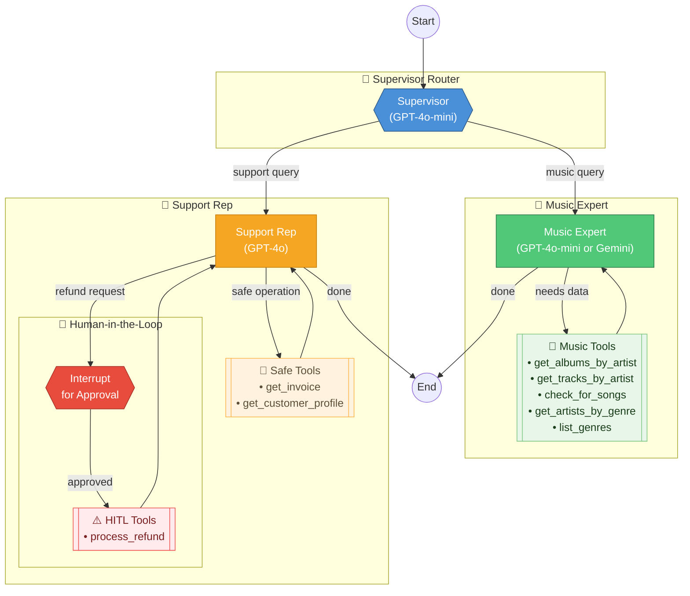

# Music Store Assistant - Algorhythm Customer Support Bot

[](https://github.com/scarolan/music_store_assistant/actions/workflows/ci.yml)

A LangGraph-based customer support chatbot demonstrating the Supervisor/Router pattern with Human-in-the-Loop (HITL) for sensitive operations.

## Architecture



### Flow Summary

| Component | Model | Purpose |
|-----------|-------|---------|
| **Supervisor** | GPT-4o-mini | Routes requests to Music Expert or Support Rep |
| **Music Expert** | GPT-4o-mini (or Gemini 2.0 Flash) | Catalog queries - albums, tracks, artists, genres |
| **Support Rep** | GPT-4o | Account info, invoices, refunds |
| **HITL Gate** | — | Requires human approval for refunds |

## Setup

1. Create a `.env` file with your API keys:
   ```
   OPENAI_API_KEY=your-key-here
   LANGCHAIN_API_KEY=your-key-here
   LANGCHAIN_TRACING_V2=true
   LANGCHAIN_PROJECT=music-store-assistant
   ```

2. Install dependencies:
   ```bash
   uv sync
   ```

3. Download the Chinook database (if not present):
   ```bash
   curl -o Chinook.db https://github.com/lerocha/chinook-database/raw/master/ChinookDatabase/DataSources/Chinook_Sqlite.sqlite
   ```

## Usage

```python
from src.graph import create_graph

graph = create_graph()
config = {"configurable": {"customer_id": 1}}

result = graph.invoke({"messages": [("user", "What albums does AC/DC have?")]}, config)
```

## Testing

```bash
pytest
```

## Project Structure

```
├── src/
│   ├── __init__.py
│   ├── graph.py        # Main LangGraph definition
│   ├── state.py        # TypedDict state schema
│   ├── tools/
│   │   ├── __init__.py
│   │   ├── music.py    # Read-only catalog tools
│   │   └── support.py  # Sensitive write tools (HITL)
│   └── utils.py        # Database utilities
├── tests/              # Pytest test suite
├── Chinook.db          # SQLite database
└── pyproject.toml
```
