# Music Store Assistant - Algorhythm Customer Support Bot

[](https://github.com/scarolan/music_store_assistant/actions/workflows/ci.yml)
[](https://opensource.org/licenses/MIT)

**A demonstration of production-ready LLM observability using OpenTelemetry and Grafana Cloud.**

This project showcases how to instrument an AI agent application with full observability - tracking costs, performance, and behavior in production. The demo implements a customer support chatbot with:

- **Multi-agent architecture** (Supervisor/Router pattern)
- **Human-in-the-Loop** approval for sensitive operations
- **Full OpenTelemetry instrumentation** for LLM observability
- **Grafana Cloud integration** with pre-built dashboard
- **Multi-provider LLM support** (OpenAI, Anthropic, Google, DeepSeek)

📖 **[Read the blog post](https://grafana.com/blog/)** about adding OTEL to LLM applications

🔧 **[Implementation guide](OTEL_IMPLEMENTATION.md)** for technical deep-dive

## Architecture

```mermaid
flowchart TD
    Start((Start)) --> supervisor

    subgraph Routing["🎯 Supervisor Router"]
        supervisor{{"Supervisor<br/>(GPT-4o-mini)"}}
    end

    supervisor -->|"music query"| music_expert
    supervisor -->|"support query"| support_rep

    subgraph Music["🎵 Music Expert"]
        music_expert["Music Expert<br/>(GPT-4o-mini)"]
        music_tools[["🔧 Music Tools<br/>• get_albums_by_artist<br/>• get_tracks_by_artist<br/>• check_for_songs<br/>• get_artists_by_genre<br/>• list_genres"]]
        music_expert -->|"needs data"| music_tools
        music_tools --> music_expert
    end

    subgraph Support["💼 Support Rep"]
        support_rep["Support Rep<br/>(GPT-4o-mini)"]
        support_tools[["🔧 Safe Tools<br/>• get_invoice<br/>• get_customer_profile"]]
        refund_tools[["⚠️ HITL Tools<br/>• process_refund"]]
        
        support_rep -->|"safe operation"| support_tools
        support_rep -->|"refund request"| hitl
        support_tools --> support_rep
        
        subgraph HITL["🛑 Human-in-the-Loop"]
            hitl{{"Interrupt<br/>for Approval"}}
            hitl -->|"approved"| refund_tools
        end
        
        refund_tools --> support_rep
    end

    music_expert -->|"done"| End((End))
    support_rep -->|"done"| End

    style supervisor fill:#4a90d9,stroke:#2d5a87,color:#fff
    style music_expert fill:#50c878,stroke:#2d7a4a,color:#fff
    style support_rep fill:#f5a623,stroke:#c77d0a,color:#fff
    style hitl fill:#e74c3c,stroke:#a93226,color:#fff
    style music_tools fill:#e8f5e9,stroke:#81c784,color:#1a3d1a
    style support_tools fill:#fff3e0,stroke:#ffb74d,color:#5d4e37
    style refund_tools fill:#ffebee,stroke:#ef5350,color:#7a1f1f
```



### Flow Summary

| Component | Model | Purpose |
|-----------|-------|---------|
| **Supervisor** | GPT-4o-mini | Routes requests to Music Expert or Support Rep |
| **Music Expert** | GPT-4o-mini | Catalog queries - albums, tracks, artists, genres |
| **Support Rep** | GPT-4o-mini | Account info, invoices, refunds |
| **HITL Gate** | — | Requires human approval for refunds |

## Quick Start

### 1. Prerequisites

- Python 3.12+ (or use `uv python install 3.12`)
- [uv](https://docs.astral.sh/uv/) package manager
- OpenAI API key (or Anthropic/Google)
- [Grafana Cloud account](https://grafana.com/get) (free tier works great)

### 2. Setup

Clone and install:
```bash
git clone https://github.com/scarolan/music_store_assistant
cd music_store_assistant
uv sync
```

Download the Chinook database:
```bash
curl -o Chinook.db https://github.com/lerocha/chinook-database/raw/master/ChinookDatabase/DataSources/Chinook_Sqlite.sqlite
```

### 3. Configure Observability

Create a `.env` file with your configuration (see `.env.example` for full options):

```bash
# Required: LLM Provider
OPENAI_API_KEY=your-openai-key-here

# Required: OTEL Tracing to Grafana Cloud
OTEL_EXPORTER_OTLP_ENDPOINT=https://otlp-gateway-prod-us-central-0.grafana.net/otlp
OTEL_EXPORTER_OTLP_HEADERS=Authorization=Basic%20<your-base64-credentials>
OTEL_SERVICE_NAME=music-store-assistant

# Optional: LangSmith (complementary debugging tool)
# LANGCHAIN_TRACING_V2=true
# LANGCHAIN_API_KEY=lsv2_your-key-here
```

**Getting OTEL credentials:**
1. Go to [Grafana Cloud](https://grafana.com/get) → Connections → OpenTelemetry
2. Copy Instance ID and generate API token
3. Base64 encode: `echo -n "instance_id:api_token" | base64`
4. Use format: `Authorization=Basic%20<result>`

See [OTEL_IMPLEMENTATION.md](OTEL_IMPLEMENTATION.md) for detailed setup instructions.

### 4. Run the Application

```bash
uv run uvicorn src.api:app --host 0.0.0.0 --port 8080
```

Then open:
- **Customer chat**: http://localhost:8080
- **Admin dashboard** (HITL approvals): http://localhost:8080/admin

### 5. View Traces in Grafana

1. Go to your Grafana Cloud instance → Explore → Tempo
2. Query: `{service.name="music-store-assistant"}`
3. Click on any trace to see the full conversation flow
4. Import `llm_o11y_dashboard.json` for the pre-built dashboard

## Model Configuration

Models are configured via environment variables with provider auto-detection:

| Agent | Default Model | Why |
|-------|---------------|-----|
| Supervisor | gpt-4o-mini | Fast routing decisions |
| Music Expert | gpt-4o-mini | Consistent, reliable responses |
| Support Rep | gpt-4o-mini | Reliable for account operations |

```bash
# Override any model:
export MUSIC_EXPERT_MODEL=claude-3-5-haiku-20241022  # Anthropic
export MUSIC_EXPERT_MODEL=gpt-4o                      # OpenAI
export MUSIC_EXPERT_MODEL=deepseek-chat               # Budget option
```

Available env vars: `SUPERVISOR_MODEL`, `MUSIC_EXPERT_MODEL`, `SUPPORT_REP_MODEL`

Provider is auto-detected from model name prefix (`gpt-*`, `claude-*`, `gemini-*`, `deepseek-*`).

## Usage

### Web UI (Recommended for Demos)

```bash
uv run uvicorn src.api:app --reload --host 0.0.0.0 --port 8000
```

Then open http://localhost:8000 for the customer chat interface, or http://localhost:8000/admin for the HITL approval dashboard.

### Python API

```python
from src.graph import create_graph

graph = create_graph()

# customer_id is passed via context= (secure, not in state)
result = graph.invoke(
    {"messages": [("user", "What albums does AC/DC have?")]},
    config={},
    context={"customer_id": 16}
)
```

### CLI

```bash
uv run python -m src.cli
```

## Testing

Run the full test suite:
```bash
uv run pytest
```

Run specific tests:
```bash
uv run pytest -v -k test_refund  # HITL flow tests
uv run pytest -v -k test_music   # Music expert tests
```

## Contributing

This is a demonstration project for Grafana Labs. Issues and pull requests are welcome!

See [LICENSE](LICENSE) for details.

## License

MIT License - see [LICENSE](LICENSE) file for details.

## Questions?

- **Issues**: [GitHub Issues](https://github.com/scarolan/music_store_assistant/issues)
- **Grafana Community**: [Community Slack](https://slack.grafana.com/)
- **Contact**: Sean Carolan ([@scarolan](https://github.com/scarolan))

## What You'll See: Observability in Action

Once running, you'll have full visibility into your LLM application:

### 📊 In Grafana Cloud
- **Token usage and costs** - Track spend per conversation, agent, and model
- **Performance metrics** - P50/P95/P99 latency for each operation
- **Trace hierarchy** - See every LLM call, tool execution, and state transition
- **Error tracking** - Identify and debug failures with full context
- **Custom dashboard** - Pre-built panels for key metrics

### 🔍 Example Queries

Try these in the chat interface:
- "What albums does AC/DC have?" (routes to Music Expert)
- "Show me my recent orders" (routes to Support Rep)
- "I want a refund for invoice 98" (triggers HITL approval)

Watch the traces appear in Grafana in real-time!

## Project Structure

```
├── src/
│   ├── graph.py        # LangGraph definition + model factory
│   ├── state.py        # State schemas
│   ├── api.py          # FastAPI backend + HITL management
│   ├── cli.py          # Interactive CLI
│   ├── otel.py         # 🔭 OpenTelemetry configuration + filtering
│   ├── utils.py        # Database utilities
│   └── tools/
│       ├── music.py    # Read-only catalog tools
│       └── support.py  # Sensitive write tools (HITL)
├── static/
│   ├── index.html      # Customer chat interface
│   └── admin.html      # HITL approval dashboard
├── tests/              # Pytest suite (80+ tests)
├── llm_o11y_dashboard.json  # 📈 Grafana dashboard (import me!)
├── OTEL_IMPLEMENTATION.md   # Technical deep-dive
├── CLAUDE.md                # AI assistant context guide
├── Chinook.db               # SQLite music catalog
└── .env.example             # Configuration template
```

## Documentation

- **[OTEL_IMPLEMENTATION.md](OTEL_IMPLEMENTATION.md)** - Complete technical guide for adding OTEL to your LLM app
- **[CLAUDE.md](CLAUDE.md)** - Comprehensive codebase guide for AI assistants
- **[ARCHITECTURE.md](ARCHITECTURE.md)** - Detailed system architecture and patterns

## Key Features

### 🎯 Agentic Patterns
- **Supervisor/Router**: Intent classification and routing
- **Specialized agents**: Music Expert (read-only) and Support Rep (with HITL)
- **Tool calling**: Database queries and business logic
- **Human-in-the-Loop**: Approval workflow for sensitive operations

### 🔭 Production Observability
- **OpenTelemetry instrumentation**: Auto-instrumentation with OpenInference
- **Attribute filtering**: Keeps traces lean (5-10KB vs 50-100KB raw)
- **Grafana Cloud export**: OTLP/HTTP to Tempo
- **Pre-built dashboard**: Token costs, latency, errors, model distribution

### 🔒 Security Patterns
- **Context schema**: Customer ID passed securely (not in LLM-accessible state)
- **Scoped queries**: Tools automatically filter by authenticated customer
- **HITL gate**: Only sensitive operations require approval
